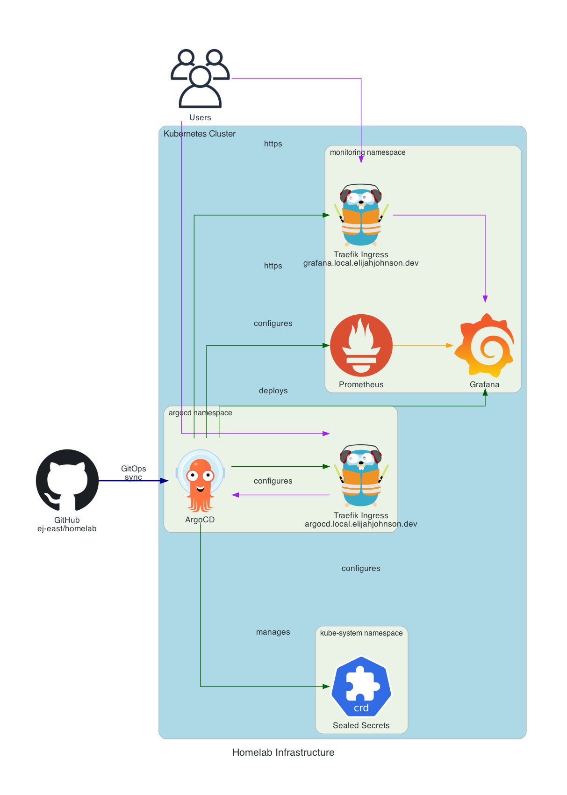

# Homelab

A GitOps-based Kubernetes homelab infrastructure using ArgoCD.

## Overview

This repository contains Kubernetes manifests managed by ArgoCD for a self-hosted homelab environment.

## Components

- **ArgoCD**: GitOps continuous delivery
- **Sealed Secrets**: Encrypted secrets management
- **Prometheus Stack**: Monitoring and alerting (Prometheus, Grafana, Alertmanager)
- **Ingress**: Traefik-based ingress with TLS

## Structure

```     
.
├── argocd
│   ├── applications # ArgoCD Application manifests
│   └── bootstrap # Root application
├── ingress # Ingress resources and TLS secrets
│   ├── argocd
│   └── monitoring
├── monitoring  # Prometheus stack configuration
└── README.md
```

## Deployment

Applications are automatically synced from this repository via ArgoCD with the following sync waves:
1. ArgoCD itself (wave: -3)
2. Sealed Secrets (wave: -2)
3. Monitoring stack (wave: 1)
4. Ingress resources

## Domain

Services are exposed at `*.local.elijahjohnson.dev`

### Current Services

- `argocd.local.elijahjohnson.dev` - ArgoCD UI
- `grafana.local.elijahjohnson.dev` - Grafana UI

## Architecture
